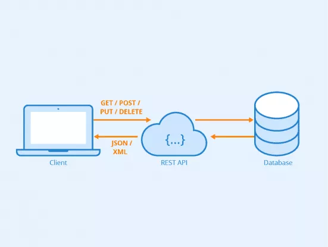
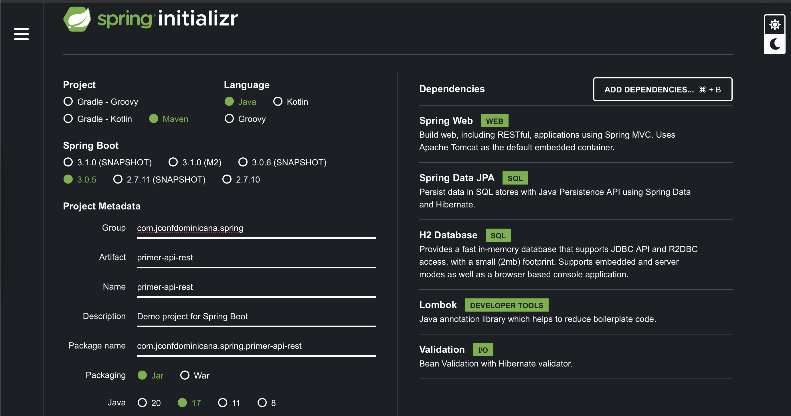
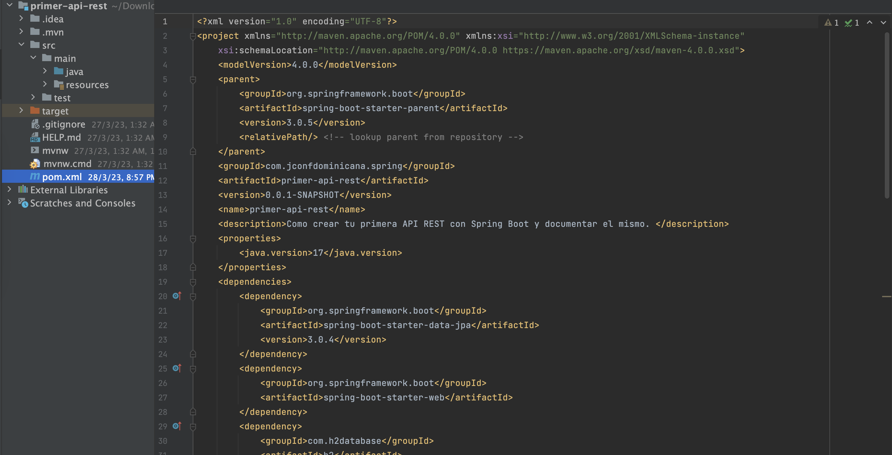
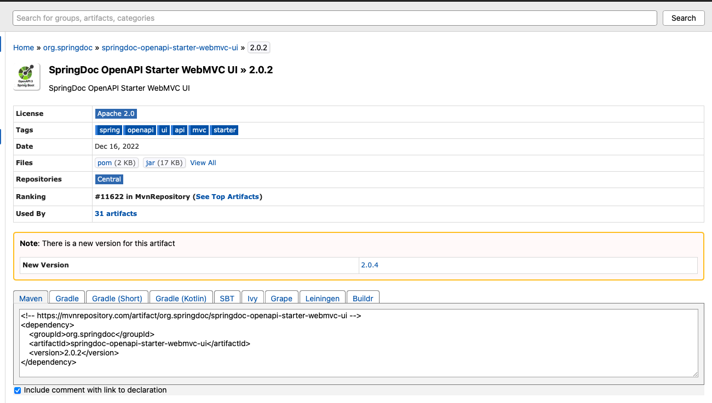
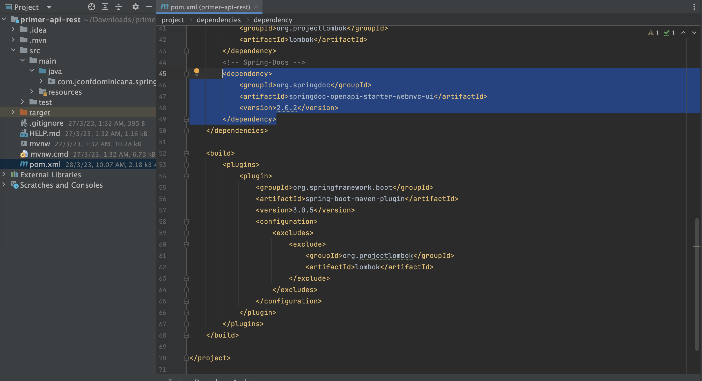
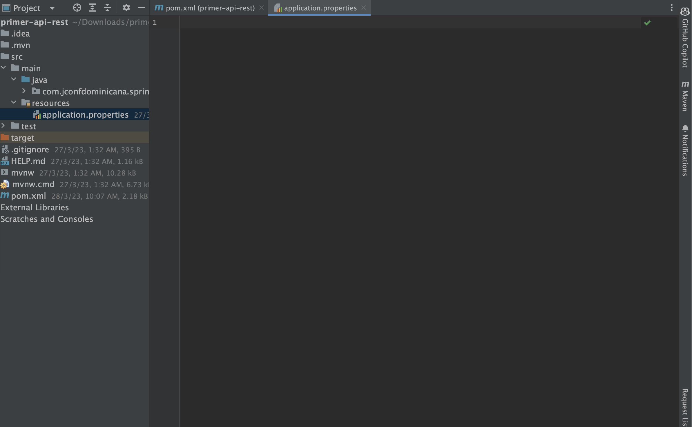
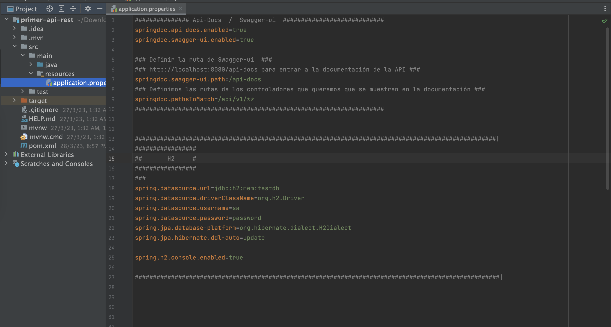

# Como crear tu primera API REST con Spring Boot

En esta guía, se explicará cómo crear una API-Rest utilizando Spring Boot. Spring Boot es un framework de Java que permite crear aplicaciones de manera rápida y sencilla. La intención es que tengas los conocimientos básicos para crear un API utilizando Spring.

# API-REST

En 2000, Roy Fielding definió REST como un estilo arquitectónico y una metodología de uso frecuente en el desarrollo de servicios de Internet, como los sistemas hipermedia distribuidos. API REST e*s* la Interfaz de Programación de Aplicaciones de Transferencia de Estado Representacional, más comúnmente conocida como servicio web REST API.

Una API REST es una interfaz de comunicación entre sistemas de información que usa el P**rotocolo de Transferencia de Hipertexto (HTTP), para obtener datos o ejecutar operaciones sobre dichos datos en diversos formatos, como pueden ser XML o JSON.**



Cuando tenemos un aplicativo REST API podemos tener la vista en distintos ambientes o sistemas.

Pongamos el caso de YouTube ellos tienen aplicaciones para Web, Android, IOS, Mac OS pero todos se conectan al API de YouTube

# Introducción a Spring y Spring Boot

Spring es un framework para aplicaciones Java que se utiliza para desarrollar aplicaciones empresariales escalables y de alta calidad. Spring Boot es una extensión de Spring que se utiliza para crear aplicaciones web y microservicios de forma rápida y sencilla.

La principal característica de Spring es su contenedor de inversión de control (IoC), que se encarga de la gestión de dependencias y de la creación de objetos.

Además, Spring proporciona un conjunto de módulos que se pueden utilizar de forma independiente o en conjunto, lo que permite a los desarrolladores elegir las funcionalidades que necesitan en su aplicación.

Spring Boot, por su parte, se encarga de la configuración y la inicialización de la aplicación, Spring Boot utiliza convenciones y configuraciones por defecto para simplificar el proceso de desarrollo y despliegue.

En resumen, Spring y Spring Boot son herramientas muy potentes para el desarrollo de aplicaciones empresariales y microservicios en Java. Si se utilizan correctamente, pueden ayudar a los desarrolladores a crear aplicaciones de alta calidad de forma rápida y sencilla.

# Spring Framework

Está compuesto por varios módulos y dependencias, entre los cuales se encuentran:

- Spring Core: este módulo proporciona las funcionalidades fundamentales del contenedor de inversión de control (IoC) y la inyección de dependencias (DI).
- Spring Context: este módulo proporciona el contexto de aplicación de Spring, que es un contenedor de objetos que maneja la configuración y la gestión del ciclo de vida de los objetos de la aplicación.
- Spring AOP: este módulo proporciona soporte para la programación orientada a aspectos (AOP), que permite separar las preocupaciones transversales de la aplicación (como el registro y la seguridad) de la lógica de negocio.
- Spring JDBC: este módulo proporciona soporte para la capa de persistencia de la aplicación, utilizando JDBC (Java Database Connectivity).
- Spring ORM: este módulo proporciona soporte para la integración de diferentes frameworks de mapeo objeto-relacional (ORM), como Hibernate o JPA.
- Spring Web: este módulo proporciona soporte para el desarrollo de aplicaciones web utilizando diferentes frameworks, como Spring MVC o Spring WebFlux.
- Spring Test: este módulo proporciona herramientas para el testing de aplicaciones Spring, como la integración de JUnit y la creación de objetos mock.

Estos son solo algunos de los módulos más importantes de Spring Framework, pero existen muchos otros que proporcionan diferentes funcionalidades. Los desarrolladores pueden elegir los módulos que necesitan para su aplicación y utilizarlos de forma independiente o en conjunto.

# Ventajas con Spring Framework

Existen varias al utilizar Spring Framework en el desarrollo de aplicaciones empresariales en Java:

- Abstracción de la infraestructura: Spring se encarga de la gestión de dependencias y de la creación de objetos, lo que permite a los desarrolladores centrarse en la lógica de negocio y no en la gestión de la infraestructura.
- Modularidad: Spring proporciona un conjunto de módulos que se pueden utilizar de forma independiente o en conjunto, lo que permite a los desarrolladores elegir las funcionalidades que necesitan en su aplicación.
- Facilidad de testing: Spring proporciona herramientas para el testing de aplicaciones Spring, como la integración de JUnit y la creación de objetos mock.
- Integración con otros frameworks: Spring se integra fácilmente con otros frameworks y tecnologías, como Hibernate, JPA, Struts y JSF, entre otros.
- Comunidad activa: Spring cuenta con una gran comunidad de desarrolladores, lo que asegura que la herramienta esté actualizada y se solucionen rápidamente los problemas que puedan surgir.

# Spring Boot

Está compuesto por varios módulos y dependencias, entre los cuales se encuentran:

- Spring Boot Starter: esta es la dependencia principal de Spring Boot, y proporciona un conjunto de módulos básicos para la construcción de aplicaciones web y microservicios.
- Spring Boot Autoconfigure: este módulo utiliza la reflexión y la información de la clase del proyecto para configurar automáticamente la aplicación Spring Boot.
- Spring Boot Actuator: este módulo proporciona diferentes características para la monitorización y gestión de la aplicación, como la exposición de endpoints de información en tiempo de ejecución.
- Spring Boot DevTools: este módulo proporciona diferentes herramientas para el desarrollo de la aplicación, como la recarga automática de la aplicación cuando se realizan cambios en el código fuente.

Además, Spring Boot también utiliza muchas de las dependencias de Spring Framework, lo que proporciona una amplia gama de módulos y funcionalidades para los desarrolladores.

# Ventajas con Spring Boot

Existen varias ventajas al utilizar Spring Boot en el desarrollo de aplicaciones web y microservicios en Java:

- Configuración fácil: Spring Boot utiliza convenciones y configuraciones por defecto para simplificar el proceso de desarrollo y despliegue.
- Integración con otras herramientas: Spring Boot se integra fácilmente con otras herramientas de desarrollo, como Maven, Gradle y Eclipse, lo que facilita el proceso de desarrollo.
- Facilidad de testing: Spring Boot proporciona herramientas para el testing de aplicaciones Spring, como la integración de JUnit y la creación de objetos mock.
- Monitorización y gestión: Spring Boot Actuator proporciona diferentes características para la monitorización y gestión de la aplicación, lo que facilita el mantenimiento de la misma.

Además, Spring Boot también ofrece una serie de características adicionales que facilitan el proceso de desarrollo, como la inclusión de un servidor web embebido, que permite ejecutar la aplicación sin necesidad de un servidor externo.

Otra de las ventajas de Spring Boot es la facilidad de implementación de microservicios. Al utilizar Spring Boot, los desarrolladores pueden crear fácilmente servicios pequeños y autónomos, que se comunican entre sí mediante protocolos ligeros, como REST.

Por último, cabe destacar que Spring Boot cuenta con una amplia comunidad de desarrolladores, lo que asegura que la herramienta esté actualizada y se solucionen rápidamente los problemas que puedan surgir.

# Anotaciones en Spring Boot

Para crear un API REST con Spring Boot, se utilizan una serie de anotaciones que permiten mapear las solicitudes HTTP a métodos específicos del controlador y definir el comportamiento de estos métodos. A continuación se describen algunas de las anotaciones más comunes:

- `@SpringBootApplication`: Esta anotación indica que la clase es una aplicación Spring Boot. Esta anotación combina otras tres anotaciones: `@Configuration`, `@EnableAutoConfiguration` y `@ComponentScan`.
  - `@Configuration` : Esta anotación se utiliza para indicar que una clase es una fuente de configuración de Spring. Esta anotación se utiliza en conjunto con otras anotaciones, como `@Bean` y `@ComponentScan`, para definir la configuración de la aplicación.

    La anotación `@Configuration` se utiliza en una clase que contiene métodos anotados con `@Bean`, que definen los objetos que se gestionan mediante el contenedor de inversión de control de Spring. Este contenedor se encarga de la creación y gestión de los objetos, lo que permite que los desarrolladores se centren en la lógica de negocio.

    En resumen, la anotación `@Configuration` se utiliza para indicar que una clase es una fuente de configuración de Spring, y se utiliza en conjunto con otras anotaciones para definir la configuración de la aplicación.


    Las anotaciones son una parte fundamental de Spring Boot, ya que permiten la configuración y personalización de la aplicación de forma sencilla y eficiente. Algunas de las anotaciones más utilizadas en Spring Boot son:
    
    - `@EnableAutoConfiguration`: Es una de las anotaciones más importantes de Spring Boot, ya que se encarga de configurar automáticamente la aplicación en función de las dependencias incluidas en el proyecto. Esta anotación utiliza la reflexión y la información de la clase del proyecto para detectar las dependencias y configurar la aplicación de forma automática.
        
        Por ejemplo, si se incluye la dependencia `spring-boot-starter-web`, que proporciona un servidor web embebido y las funcionalidades básicas para el desarrollo de aplicaciones web, la anotación `@EnableAutoConfiguration` se encargará de configurar automáticamente la aplicación con estas funcionalidades.
        
        En resumen, la anotación `@EnableAutoConfiguration` es esencial para el desarrollo de aplicaciones Spring Boot, ya que permite la configuración automática de la aplicación en función de las dependencias incluidas en el proyecto.
        
    - `@ComponentScan`: Es una de las más importantes en Spring Boot, ya que se utiliza para buscar y cargar automáticamente los beans dentro del contexto de Spring. Esta anotación escanea el paquete actual y sus subpaquetes en busca de clases anotadas con @Component, @Service, @Repository o @Controller, y las registra como beans en el contexto de Spring.
        
        Además, @ComponentScan también puede configurarse para buscar beans en paquetes específicos usando el atributo "basePackages" o "basePackageClasses". Por ejemplo, si queremos buscar beans en el paquete "com.example.beans", podemos usar la siguiente configuración:
        
        ```java
        @ComponentScan(basePackages = "com.example.beans")
        ```
        
        También podemos usar varias rutas de paquetes separadas por comas:
        
        ```java
        @ComponentScan(basePackages = {"com.example.beans", "com.example.services"})
        ```
        
        Otra forma de configurar @ComponentScan es usar el atributo "basePackageClasses" para buscar beans en paquetes que contienen clases específicas. Por ejemplo, si tenemos una clase "com.example.beans.BeanA", podemos usar la siguiente configuración para buscar beans en el paquete que contiene esta clase:
        
        ```java
        @ComponentScan(basePackageClasses = BeanA.class)
        ```

- `@Entity`: Anotación para indicar que una clase representa una entidad en la base de datos. Esta anotación se utiliza en conjunto con JPA (Java Persistence API) para definir la estructura de la tabla en la base de datos y las relaciones entre diferentes entidades.

  En lo interno podemos ver:

  - `@Id`: Anotación para indicar que un campo de la clase es la clave primaria de la entidad. Esta anotación se utiliza en conjunto con `@Entity` y permite definir la clave primaria de la tabla en la base de datos.
  - `@GeneratedValue`: anotación para indicar que el valor de un campo de la clase será generado automáticamente por la base de datos. Esta anotación se utiliza en conjunto con `@Id` y permite definir el tipo de generación (por ejemplo, secuencia o identidad) y otros parámetros de configuración.
  - `@Column`: Esta anotación se utiliza para especificar el nombre de la columna en la base de datos que se va a mapear con el atributo de la clase. Además, permite indicar otras características de la columna, como su longitud máxima, si puede ser nula, entre otras.
  - `@Table` ****: Con esta anotación se puede especificar el nombre de la tabla en la base de datos que se va a mapear con la entidad.
  - `@Temporal` ****: Se utiliza para indicar que un atributo de la entidad es de tipo fecha o tiempo. Permite especificar el formato en el que se va a almacenar la fecha en la base de datos.
  - `@ManyToOne` ****: Esta anotación se utiliza en relaciones de muchos a uno entre entidades. Permite especificar la entidad dueña de la relación y la columna que se va a utilizar como clave foránea.
  - `@ManyToMany` ****: Esta anotación se utiliza en relaciones de muchos a muchos entre entidades. Permite especificar la tabla intermedia que se va a utilizar para almacenar la relación y las columnas que se van a utilizar como claves foráneas.
  - `@JoinColumn` ****: Se utiliza en combinación con las anotaciones `@ManyToOne` y `@ManyToMany` para especificar el nombre de la columna que se va a utilizar como clave foránea en la entidad relacionada.
- `@Repository`: Anotación para indicar que una clase es un repositorio de datos. Esta anotación se utiliza en conjunto con Spring Data para definir una interfaz entre la capa de acceso a datos y la capa de servicio, y proporciona métodos para realizar operaciones CRUD (Create, Read, Update, Delete) en la base de datos.

  Las anotaciones más comunes dentro de `@Repository` son:

  - `@Transactional`: Esta anotación indica que todos los métodos de la clase deben ser ejecutados dentro de una transacción. Esto puede ser útil para mantener la integridad de los datos en situaciones de alta concurrencia.
  - `@Query`: Con esta anotación podemos definir consultas personalizadas en JPQL (Java Persistence Query Language) o SQL nativo.
  - `@Modifying`: Esta anotación indica que el método modificará los datos en la base de datos. Es importante tener en cuenta que para que esto funcione correctamente, la anotación `@Transactional` también debe ser utilizada.
  - `@EntityGraph`: Esta anotación nos permite definir una consulta con un subconjunto de atributos de una entidad. Esto puede mejorar el rendimiento de la aplicación al reducir la cantidad de datos que se deben transferir desde la base de datos.

  Es importante tener en cuenta que estas anotaciones no son exclusivas de `@Repository`, y pueden ser utilizadas en otras partes de la aplicación.

- `@RestController`: Anotación para indicar que la clase es un controlador REST. Esta anotación combina las funcionalidades de `@Controller` y `@ResponseBody`, lo que significa que la respuesta del controlador se devuelve directamente como una respuesta HTTP, sin necesidad de usar una vista.
  - `@RequestMapping`: Anotación para mapear las solicitudes HTTP a métodos específicos del controlador. Esta anotación se puede aplicar a nivel de clase o de método, y permite definir el URI y los verbos HTTP que se deben usar para acceder a cada método del controlador.
  - `@GetMapping`, `@PostMapping`, `@PutMapping` y `@DeleteMapping` anotaciones para mapear solicitudes HTTP GET, POST, PUT y DELETE respectivamente, a métodos específicos del controlador. Estas anotaciones son una forma más específica de `@RequestMapping` que permite definir el verbo HTTP que se debe usar para acceder a cada método.
  - `@RequestBody`: Anotación para indicar que un parámetro del método debe vincularse con el cuerpo de la solicitud HTTP. Esta anotación permite recibir datos en formato JSON o XML en el cuerpo de la solicitud, y convertirlos automáticamente en un objeto Java.
  - `@PathVariable`: Anotación para indicar que un parámetro del método debe vincularse con una variable en la URL de la solicitud HTTP. Esta anotación permite recibir valores dinámicos en la URL, como identificadores de recursos o nombres de usuarios.
  - `@RequestParam`: Anotación para indicar que un parámetro del método debe vincularse con un parámetro en la URL de la solicitud HTTP. Esta anotación permite recibir valores estáticos en la URL, como parámetros de búsqueda o filtros.
  - `@ResponseStatus`: Anotación para especificar el código de estado HTTP que se debe devolver como respuesta a la solicitud HTTP. Esta anotación permite personalizar la respuesta HTTP en función del resultado de la operación, por ejemplo, devolviendo un código 404 si el recurso no existe.
  - `@ExceptionHandler`: Anotación para indicar que un método manejará excepciones específicas que se produzcan en el controlador. Esta anotación permite definir un método de recuperación para errores específicos, como errores de validación o errores de acceso a la base de datos.

# Requerimientos

Java 17

Spring `3.0.5`+

IntelliJ IDEA o (su Ide favorito)

Apache Maven 3.8.3+

H2

# Creando el proyecto

Vamos a la parte práctica…

## Paso 1: Creación y Configuración del proyecto Spring Boot

- Creando el proyecto Spring Boot

  Lo primero que debemos hacer es crear un nuevo proyecto en [`https://start.spring.io`](https://start.spring.io/) o tener el plugin de Spring initializr en nuestro IDE preferido.

  
  Generamos el proyecto, lo descargamos y lo abrimos con nuestro IDE.

  
- 

- Agregar SpringDoc al POM

  Agregaremos una dependencia de un tercero en este caso el de la documentación Swagger desde MVN-Repository [`https://mvnrepository.com`](https://mvnrepository.com/)

  

    ```
    <!-- https://mvnrepository.com/artifact/org.springdoc/springdoc-openapi-starter-webmvc-ui -->
    <dependency>
        <groupId>org.springdoc</groupId>
        <artifactId>springdoc-openapi-starter-webmvc-ui</artifactId>
        <version>2.0.2</version>
    </dependency>
    ```

  Luego lo agregamos en el POM…

  

- Configuración del proyecto

  Configuraremos el archivo application.properties que esta en la ruta `src/main/resources`

  

  dentro del archivo creamos las configuraciones para la la Documentación utilizando Swagger, la conectividad a la BD en este caso H2 para la persistencia de los datos.

  - Swagger
    1. Habilitamos api-docs
    2. Habilitamos swagger-ui
    3. Definimos la ruta que pondremos en el explorador para cargar la vista de la documentación `http://localhost:8080/api-docs.html`
    4. Definimos cual o cuales serán las rutas de los endpoint que estarán visible en la documentación, es decir que en los endpoint que estén `http://localhost:8080/api/v1/`mas las que agreguen serán visible.

      ```
      springdoc.api-docs.enabled=true
      springdoc.swagger-ui.enabled=true
      
      springdoc.swagger-ui.path=/api-docs.html
      
      springdoc.pathsToMatch=/api/v1/**
      ```

  - Conexión a BD

    Tendremos una configuración para conectarnos a H2, agregamos una lineas para documentar lo que hacemos en cada una de ellas.

      ```
      ####################################################################################################|
      ####################################################################################################|
      ###       H2     ##       H2     ##       H2     ##       H2     ##       H2     ##       H2     ###|
      ####################################################################################################|
      ## Propiedades de la BD con su coneccion y Driver ##
      spring.datasource.url=jdbc:h2:mem:testdb
      spring.datasource.driverClassName=org.h2.Driver
      #. Definimos el Usuario y Clave
      spring.datasource.username=sa
      spring.datasource.password=password
      ####
      ##### Propiedades de Hibernate   ##
      ##### El dialecto SQL hace que Hibernate genere un mejor SQL para la BD elegida ##
      spring.jpa.database-platform=org.hibernate.dialect.H2Dialect
      ####
      ##### Hibernate auto ddl, Si la Tablas no existe (update) si ya existe ponemos (none) #
      #######   Tenga mucho cuidado con esto en producción   #
      spring.jpa.hibernate.ddl-auto=update
      
      spring.h2.console.enabled=true
      
      ####################################################################################################|
      ####################################################################################################|
      ####################################################################################################|
      ```

    Si usted utiliza Yaml seria algo así…

      ```
      spring:
        datasource:
          url: jdbc:h2:mem:mydb
          username: sa
          password: password
          driverClassName: org.h2.Driver
        jpa:
          spring.jpa.database-platform: org.hibernate.dialect.H2Dialect
      ```


Todo esto se ve así en mi caso utilizando properties
    



## Paso 2: Creación de las clases

Una vez que hemos configurado nuestro proyecto, Creamos los paquetes y nuestras clases.

Tendremos la clase Entity, la clase Repository, y la clase controller que manejará las solicitudes y respuestas de nuestra API.

- Entity

  Creamos nuestro Paquete Entity y en el creamos una clase java `Persona`

  Esta clase seria nuestra primera entidad y en ella también agregaremos las anotaciones `@Entity` que como ya sabemos es la que le dice Spring Boot esta clase es de tipo Entity y otras mas que ya definimos mas arriba en esta guía.

    ```
    import jakarta.persistence.Id;
    import jakarta.persistence.Entity;
    import jakarta.persistence.Table;
    import jakarta.persistence.GeneratedValue;
    import jakarta.persistence.GenerationType;
    import jakarta.persistence.Column;
    import lombok.Getter;
    import lombok.Setter;
    
    import java.io.Serializable;
    
    @Entity
    @Table(name = "personaa")
    @Getter
    @Setter
    public class Persona implements Serializable {
    
        @Id
        @GeneratedValue(strategy = GenerationType.IDENTITY)
        @Column(name = "persona_id", nullable = false, unique = true)
        private Long personaId;
    
        @Column(name = "name")
        private String name;
    
        @Column(name = "last_name")
        private String lastName;
    
        @Column(name = "age")
        private int age;
    
        @Column(name = "email")
        private String email;
    
    }
    ```

- Repository

  Creamos un paquete que contendrá las clases tipo “interface” de nuestro proyecto, crearemos nuestra primera clase de este tipo y la llamaremos `PersonaRepository` .

  Esta clase la anotamos con `@Repository` para que Spring Boot entienda que esta es una clase Repository, extenderemos del `CrudRepository` y le pasamos la clase entidad.

  Al extender de CrudRepository tendremos métodos ya predefinidos como findByAll, findById, save, delete, otros mas y los que podemos implementar nosotros mismos.

    ```
    import com.jconfdominicana.spring.primerapirest.entity.Persona;
    import org.springframework.data.repository.CrudRepository;
    import org.springframework.stereotype.Repository;
    
    import java.util.Optional;
    
    @Repository
    public interface PersonaRepository extends CrudRepository<Persona, Long>{
        
    }
    ```

- Controller

  Creamos el paquete controller, este tendrá las clases controller del proyecto, para que una clase sea controladora de un API-REST recuerden que solo tendremos que anotarla con `@RestController` esta anotación indica que esta clase es un controlador de Spring MVC y que devolverá objetos JSON.

  También tendremos `@RequestMapping` , `@GetMapping` , `@PostMaping` , `@PathVariable` , `@RequestBody` , y `@ResponseStatus` que nos ayudaran con los verbos HTTP

    ```
    import com.jconfdominicana.spring.primerapirest.entity.Persona;
    import com.jconfdominicana.spring.primerapirest.repository.PersonaRepository;
    import org.springframework.beans.factory.annotation.Autowired;
    import org.springframework.http.HttpStatus;
    import org.springframework.http.ResponseEntity;
    import org.springframework.web.bind.annotation.*;
    
    import java.util.List;
    import java.util.Optional;
    
    @RestController
    @RequestMapping("/api/v1/persona")
    public class PersonaController {
    
        @Autowired
        PersonaRepository personaRepository;
    
        @GetMapping("/getpersonas")
        @ResponseStatus(HttpStatus.OK)
        public List<Persona> getAllPersona(){
            return (List<Persona>) personaRepository.findAll();
        }
    
        @GetMapping("/getname/{name}")
        @ResponseStatus(HttpStatus.OK)
        public ResponseEntity<Persona> getPersonaByName(@PathVariable("name") String name){
            Optional<Persona> optionalPersona = personaRepository.findByName(name);
            if (!optionalPersona.isPresent()){
                return ResponseEntity.notFound().build();
            }
            else {
                return ResponseEntity.ok(optionalPersona.get());
            }
        }
    
        @PostMapping("/save")
        @ResponseStatus(HttpStatus.CREATED)
        public Persona savePersona(@RequestBody Persona persona){
            return personaRepository.save(persona);
        }
    
    }
    ```


## Paso 3: Test en explorador

Ahora, tenemos la API en el estado final de producción solo falta ponerla en producción o probar.

Corremos el proyecto en el IDE, y abrimos nuestro navegador en la URL `[http://localhost:8080/api-docs.html](http://localhost:8080/api-docs.html)` que este fue el que definimos en la propiedades de la aplicación.